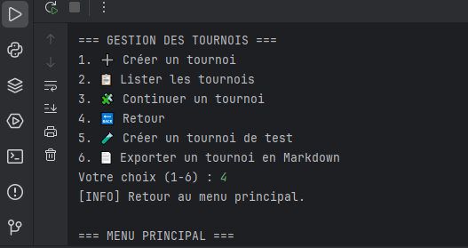
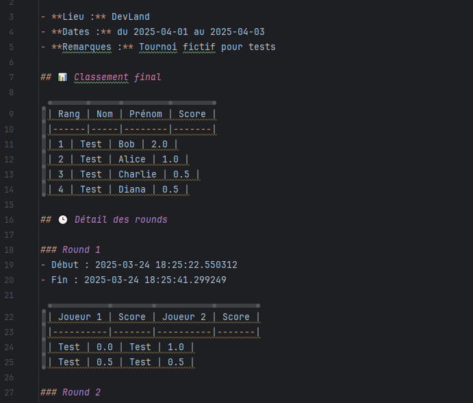
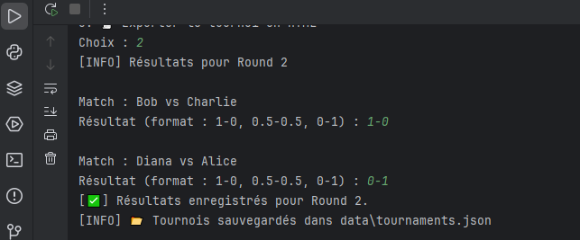
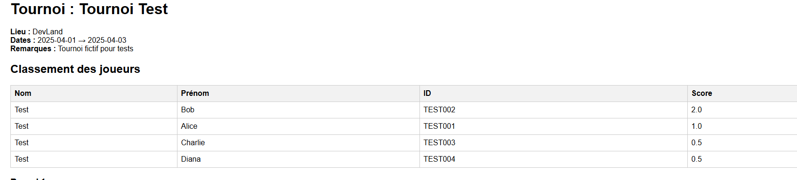

# ♟️ Projet 4 – Gestionnaire de Tournoi d'Échecs (OpenClassrooms)

> Application Python pour organiser, gérer et suivre des tournois d’échecs en local, développée dans le cadre du [Projet 4 de la formation Développeur Python – OpenClassrooms](https://openclassrooms.com/fr/projects/834).

---

## 🚀 Fonctionnalités principales

- ✅ Création manuelle de joueurs
- ✅ Création de tournois (réel ou automatique pour test)
- ✅ Gestion des rounds (4 max) avec appariements suisses
- ✅ Saisie rapide des résultats (`1-0`, `0.5-0.5`, etc.)
- ✅ Classement automatique et dynamique
- ✅ Sauvegarde des données en JSON
- ✅ Export HTML 🧾 et Markdown 📄 des tournois
- ✅ Interface console claire (menus, tableaux)
- ✅ Architecture MVC + POO + persistance

---

## ⚙️ Installation

1. **Cloner le repo** :

git clone https://github.com/<ton_nom>/Projet4_Tournoi.git
cd Projet4_Tournoi

2. **Créer un environnement virtuel** :

python -m venv .venv
source .venv/Scripts/activate  # Windows
# ou
source .venv/bin/activate  # Mac/Linux

3. **Installer les dépendances** :

pip install -r requirements.txt


## ⚙️ Lancement

python tournoi/main.py


## ⚙️ Arborescence du projet

## 📂 Arborescence du projet

```text
Projet4_Tournoi/
├── tournoi/
│   ├── main.py
│   ├── controllers/
│   │   └── tournament_controller.py
│   ├── models/
│   │   ├── player.py
│   │   ├── match.py
│   │   ├── round.py
│   │   ├── tournament.py
│   │   └── data_manager.py
│   ├── views/
│   │   └── display.py
│   ├── data/
│   │   ├── players.json
│   │   └── tournaments.json
│   └── utils/
│       ├── html_exporter.py
│       └── markdown_exporter.py
├── exports/
│   ├── tournoi_*.html
│   └── rapport_*.md
├── flake8_rapport/
│   └── index.html
├── requirements.txt
└── README.md
```

## ⚙️ Démo rapide

1.  **Créer un tournoi de test** :

Tournois → 5. Créer un tournoi de test

2. **Démarrer un round** :

Tournois → 3. Continuer un tournoi → 1. Démarrer un nouveau round

3. ** Saisir les résultats** :

Format accepté : 1-0, 0.5-0.5, 0-1

4. **Export** :

→ HTML : tournoi_championnat_local.html
→ Markdown : rapport_championnat_local.md


## ⚙️ Validation PEP 8


✔️ Code vérifié avec flake8
✔️ Rapport HTML généré dans flake8_rapport/
✔️ Pas d'erreur bloquante à la soumission ✅


## 📸 Captures d’écran

###  Menu principal


###  Fhichier Markdown


###  Classement


###  Rapport HTML



## ⚙️ Bonus & Extensions

Bonus	Inclus
Interface Markdown	✅
Export HTML	✅
Tournoi de test	✅
Gestion des scores rapides	✅
Interface graphique (Tkinter)	❌
Interface web (Flask)	❌


## ⚙️ Concepts appliqués

Programmation Orientée Objet (POO)

Architecture MVC (Modèle / Vue / Contrôleur)

Gestion de fichiers JSON

Structuration modulaire

Conformité PEP8 (via flake8) :
        ✅ Code vérifié avec flake8 – conforme à la PEP8
        📄 Rapport : `flake8_rapport/index.html`


## ⚙️ Projet réalisé dans le cadre de

 OpenClassrooms – Développeur Python – Projet 4
Mission : Développer un programme logiciel en Python
Livrables : Code propre, structuré, conforme aux standards professionnels

